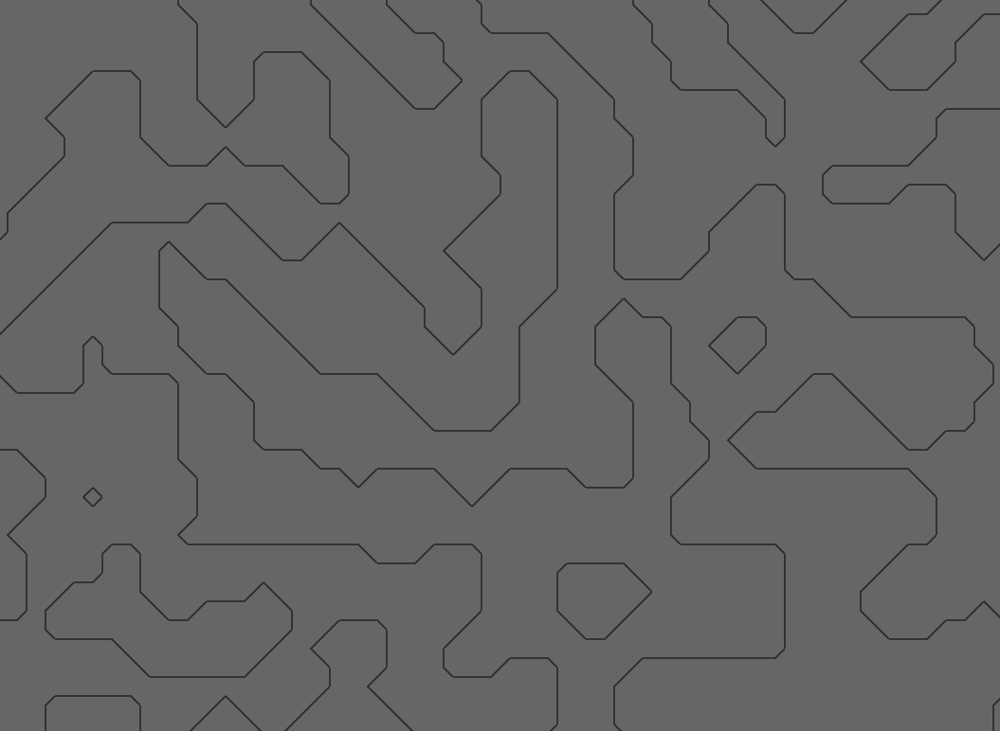

= Marching Squares

Simple Marching Squares implementation in Rust to generate nice looking patterns based on noise functions.
It's a one-off project and poorly documented (I will probably never touch it again).

.Marching Squares sample (original is much smoother, this gif is only 30fps)

== Stuff I used:

- https://www.piston.rs/[piston] for the graphics
- https://www.youtube.com/watch?v=0ZONMNUKTfU[This Marching Squares explanation] by The Coding Train
- https://github.com/razaekel/noise-rs[noise-rs] for the noise
